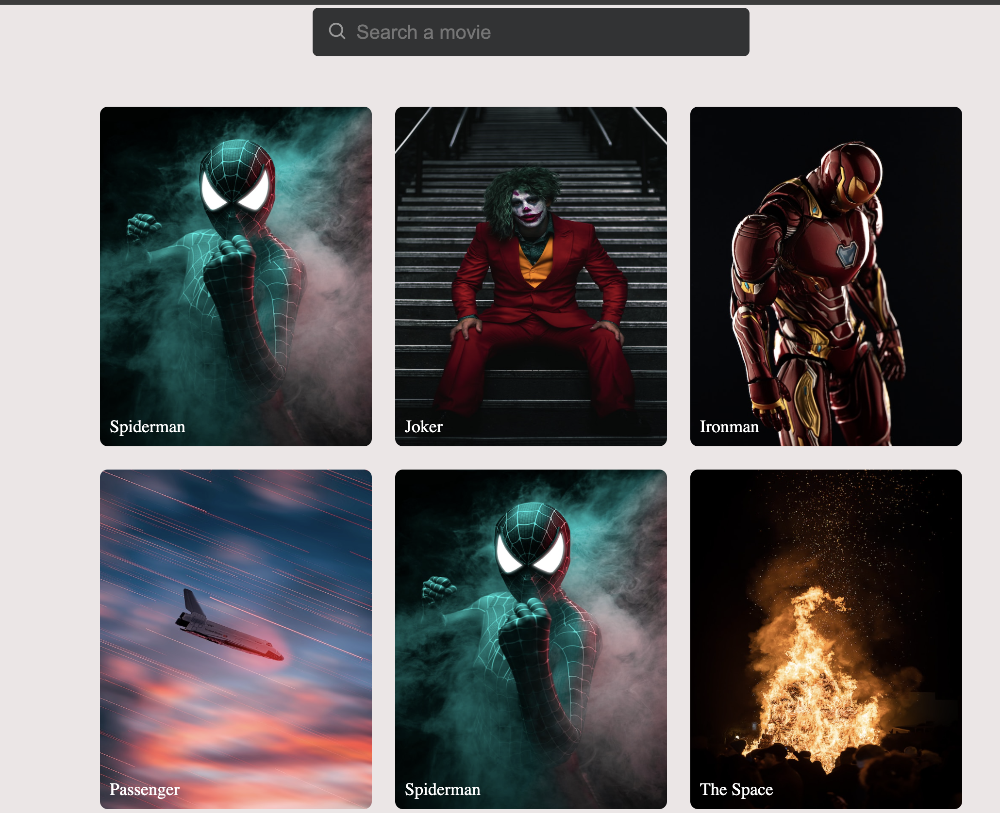

# Image gallery

> A simple

## Table of contents

- [General info](#general-info)
- [Screenshots](#screenshots)
- [Technologies](#technologies)
- [Setup](#setup)
- [Features](#features)
- [Status](#status)
- [Inspiration](#inspiration)
- [Contact](#contact)

## General info

> The objective of the project is to practice separation of concern in
> JavaScript.

## Screenshots

## Technologies

- JavaScript
- HTML5
- CSS3
- VSC code

## Setup

clone the repo and start using the stop watch.

## Code Examples

const createImage = (image) => {
    const container = document.createElement('div');
    container.classList.add('image-box');
    container.id = image.id;

    const img = document.createElement('img');
    img.src = image.src;
    img.alt = image.dataName;

    const title = document.createElement('h6');
    title.innerText = image.title;

    container.append(img, title);

    return container;
};

export default createImage;

## Features

List of features ready and Todos for future development

-
-
-

To-do list:

-
-

## Status

Project is: todo

## Inspiration

## Contact
